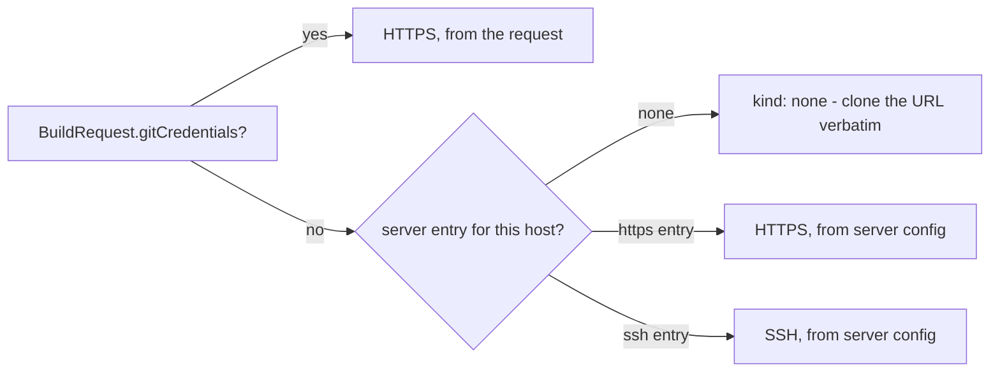

<title>Credential handling</title>

# Credential handling

Three distinct kinds of credential pass through a single `/build`
request — git (to clone), SSH host verification (to trust the git
host), and registry push auth (to push the built image) — and all three
follow the same rule: **never argv, never an environment variable read
by anything outside the one subprocess that needs it, never embedded in
a URL**. Real command lines show up in `ps` output, shell history, and
process-launch audit logs; a credential embedded in a clone URL shows up
in git's own remote config and any log line that prints it. Every
credential in this service instead goes into a scratch file, scoped to
one request, removed in a `finally` block. See
[0002: Credentials never touch argv, env history, or the clone URL](../decisions/0002-credentials-never-touch-argv-or-urls.md)
for the decision record.

## Git credentials

### Resolution: request-level wins, then per-host server config



`resolveGitCredential` (`build.ts`) checks the request's own
`gitCredentials` first (always HTTPS/username+token-shaped) before ever
looking at the server's own `gitCredentials` entries, which are keyed by
host and may be HTTPS- or SSH-shaped. Whichever source resolves decides
the **protocol** the actual clone uses (`toCloneUrl`) — independent of
whatever scheme the caller's `repository` string used. A caller can
send `https://github.example.com/org/repo.git` for a host the server
only has an *SSH* credential configured for, and the real clone still
happens over `ssh://git@github.example.com/org/repo.git`. This is what
lets a request stay protocol-agnostic while the server decides how it
actually authenticates.

### HTTPS: a scratch `.netrc`

```
machine <host>
login <username>
password <token>
```

Written to `$HOME/.netrc` inside a fresh scratch `$HOME`
(`withNetrcEnv`), `chmod 0600`, with `GIT_TERMINAL_PROMPT=0` so a
missing/wrong credential fails immediately instead of hanging on an
interactive prompt. The scratch directory (not just the file) is
per-request because `.netrc`'s own lookup is host-keyed globally within
whatever `$HOME` git sees — sharing one `$HOME` across concurrent
requests would let one request's credential leak into another's clone
of a *different* repo on the same host.

### SSH: a scratch key + `known_hosts`, gated by host key policy

```
GIT_SSH_COMMAND=ssh -i <scratch>/id \
  -o UserKnownHostsFile=<scratch>/known_hosts \
  -o StrictHostKeyChecking=yes \
  -o IdentitiesOnly=yes \
  -o BatchMode=yes
```

The private key and a real `known_hosts` entry both go into the same
scratch directory (`withSshKeyEnv`). Host key verification always
stays on (`StrictHostKeyChecking=yes` — there's no configuration path
to disable it); what *varies* is how `known_hosts` gets populated,
controlled by the deployment-wide `SSH_HOST_KEY_POLICY`:

- **`tofu`** (trust-on-first-use, the default) — `ssh-keyscan -H <host>`
  at clone time, real and live, written straight into `known_hosts`.
- **`pinned`** — the operator-supplied `pinnedHostKey` for this
  credential entry is used verbatim; no scan happens at all. Missing a
  pin under this policy is a real, user-fixable
  `BuildRequestError` ("SSH host key policy is 'pinned' but no pinned
  key configured for host `<host>`"), thrown *before* any network
  call — not a clone that fails partway through.

Full rationale (why TOFU has no "insecure" bypass, why pinning exists
at all) is in
[0004: SSH host key verification is always enforced](../decisions/0004-ssh-host-key-verification-always-enforced.md).

`BatchMode=yes` matters independent of which policy is active:
`GIT_TERMINAL_PROMPT=0` only suppresses git's *own* HTTPS-style prompts
— it does nothing for the `ssh` subprocess git spawns underneath for an
`ssh://`/SCP-style URL. Without `BatchMode=yes`, an unrecognized host or
a rejected key lets `ssh` fall through to an interactive prompt that's
invisible to anything without a TTY attached (a real hang risk for a
backend service, not just a test-suite annoyance).

### No credential configured: clone verbatim

If neither the request nor the server has a credential for the
resolved host, the clone proceeds against the repository string exactly
as given — a real, unauthenticated clone, which is exactly right for a
public repository and fails with a real, ordinary git error for a
private one no credential was ever supplied for.

## Registry push credentials

A request's own `registryCredentials` (rather than relying on whatever
the deployment's own ambient registry auth is) gets merged into a
**scratch `DOCKER_CONFIG` overlay** (`withRegistryAuthEnv`), not passed
to `docker`/`buildx` any other way:

1. Copy the *ambient* `DOCKER_CONFIG` directory into a fresh scratch
   dir — this brings along both `config.json` (existing registry auth)
   **and** `buildx/` (the already-created remote builder's own state).
   Skipping this step is the single easiest way to accidentally break
   builder reuse: `docker buildx inspect <name>` looks under whatever
   `DOCKER_CONFIG` is currently set, so a bare scratch dir with no
   `buildx/` subdirectory makes every request re-create the builder
   from scratch instead of reusing the one already running.
2. Merge in one `auths[<registry>]` entry
   (base64 `username:password`, the real Docker config-JSON shape) for
   the credential this request supplied.
3. Point the build subprocess's own `DOCKER_CONFIG` at the scratch dir;
   remove it in a `finally` block once the build (success or failure)
   completes.

No `registryCredentials` in the request means no override at all — the
build runs against whatever the deployment's own ambient
`DOCKER_CONFIG` already has (see the Helm chart's
[`registryAuth`](../reference/HELM.md#registryauth) values).
