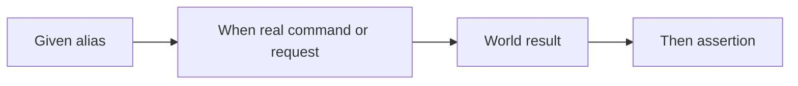

# Architecture

The harness separates object construction from actions that have side effects.
This keeps a scenario's setup readable and makes the point at which a real
command runs explicit.

## World

Cucumber's `World` stores typed aliases and the latest command or HTTP result.
Step definitions use those values to build commands and assertions without
sharing state between scenarios.

## Real boundaries

Most `Given` steps only construct an object. The Kubernetes resource aliases
are the deliberate exception: they perform a read-only `kubectl get` so later
steps can operate on an object that exists. A `Release` resolves its chart
object because the correct Helm argument depends on the chart source.

HTTP endpoints remain pure during construction. The first network operation is
the explicit request step.

## Execution flow

